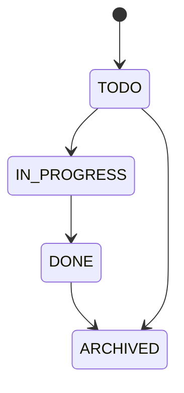
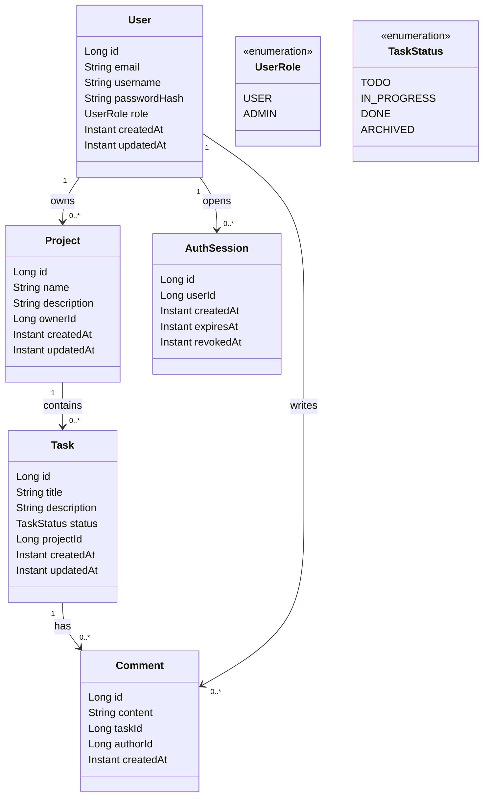

# Domain Model - Gestion de projets et taches

## Acteurs
- Visiteur : pas connecte, peut s'inscrire et se connecter.
- Utilisateur : gere ses projets et ses taches.
- Admin : supervision (liste utilisateurs, moderation simple).
- System (optionnel) : envoi de notifications et audit (evolution).

## Cas d'usage (MVP + evolutions)
- UC-01 : En tant que Visiteur, je veux creer un compte afin d'acceder a l'application.
- UC-02 : En tant que Utilisateur, je veux me connecter afin d'acceder a mes projets.
- UC-03 : En tant que Utilisateur, je veux creer un projet afin d'organiser mon travail.
- UC-04 : En tant que Utilisateur, je veux lister mes projets afin d'avoir une vue d'ensemble.
- UC-05 : En tant que Utilisateur, je veux modifier un projet afin de corriger ses informations.
- UC-06 : En tant que Utilisateur, je veux ajouter une tache a un projet afin de planifier les actions.
- UC-07 : En tant que Utilisateur, je veux changer le statut d'une tache afin de suivre l'avancement.
- UC-08 : En tant que Utilisateur, je veux filtrer les taches par statut afin de me concentrer.
- UC-09 (evolution) : En tant que Utilisateur, je veux commenter une tache afin d'ajouter un contexte.

## Entites principales (MVP - 4 entites)
- User (US-01, US-02, US-04, US-15)
- Project (US-05, US-06, US-07, US-08)
- Task (US-09, US-10, US-11, US-12)
- AuthSession (US-02, US-03)

## Entites en evolution (hors MVP)
- Comment (optionnel, si besoin de commentaires)

## Enums
- UserRole : USER, ADMIN
- TaskStatus : TODO, IN_PROGRESS, DONE, ARCHIVED

## Attributs proposes (Java)

### User
- id : Long
- email : String (unique)
- username : String (unique)
- passwordHash : String
- role : UserRole
- createdAt : Instant
- updatedAt : Instant

### Project
- id : Long
- name : String
- description : String
- ownerId : Long
- createdAt : Instant
- updatedAt : Instant

### Task
- id : Long
- title : String
- description : String
- status : TaskStatus
- projectId : Long
- createdAt : Instant
- updatedAt : Instant

### AuthSession
- id : Long
- userId : Long
- createdAt : Instant
- expiresAt : Instant
- revokedAt : Instant (nullable)

### Comment (evolution)
- id : Long
- content : String
- taskId : Long
- authorId : Long
- createdAt : Instant

## Relations et cardinalites (MVP)
- User 1..N Project : un utilisateur possede plusieurs projets.
- Project 1..N Task : un projet contient plusieurs taches.
- User 1..N AuthSession : un utilisateur peut ouvrir plusieurs sessions.
- Task 1..N Comment : une tache peut avoir plusieurs commentaires. (evolution)
- User 1..N Comment : un utilisateur peut ecrire plusieurs commentaires. (evolution)

## Regles metier (invariants et validations)

### User
- email obligatoire et unique.
- username obligatoire et unique.
- passwordHash obligatoire (stockage securise, jamais en clair).
- role obligatoire.

### Project
- name obligatoire (1 a 80 caracteres).
- un projet a exactement un owner (ownerId non nul).

### Task
- title obligatoire (1 a 120 caracteres).
- status obligatoire.
- une tache appartient a un projet (projectId non nul).

### AuthSession
- une session appartient a un utilisateur (userId non nul).
- expiresAt doit etre superieur a createdAt.
- revokedAt est optionnel (null si session active).

### Comment (evolution)
- content obligatoire (1 a 500 caracteres).
- un commentaire appartient a une tache et a un auteur.

## Workflow TaskStatus
- Etat initial : TODO
- Transitions autorisees :
  - TODO -> IN_PROGRESS
  - IN_PROGRESS -> DONE
  - DONE -> ARCHIVED
  - TODO -> ARCHIVED (annulation directe)
- Transitions interdites :
  - DONE -> TODO
  - ARCHIVED -> IN_PROGRESS
  - ARCHIVED -> DONE

### Diagramme des transitions (Mermaid)

## Regles d'autorisation (aperçu)
- Seul le owner d'un projet peut modifier ou supprimer son projet.
- Seul le owner d'un projet peut ajouter des taches dans ce projet.
- Admin peut lister tous les utilisateurs et agir en moderation.

## Lien modele <-> backlog (exemples)
| User Story | Entites impliquees | Donnees | Regles metier |
| --- | --- | --- | --- |
| US-01 Creer compte | User | email, username, passwordHash | email unique, passwordHash obligatoire |
| US-02 Login | User, AuthSession | userId, expiresAt | session liee a un user |
| US-05 Creer projet | User, Project | name, ownerId | name obligatoire, ownerId non nul |
| US-06 Lister projets | User, Project | ownerId | user ne voit que ses projets |
| US-09 Ajouter tache | Project, Task | title, projectId, status | status initial TODO |
| US-10 Changer statut tache | Task | status | transitions autorisees |

## Diagramme de classes (Mermaid)

